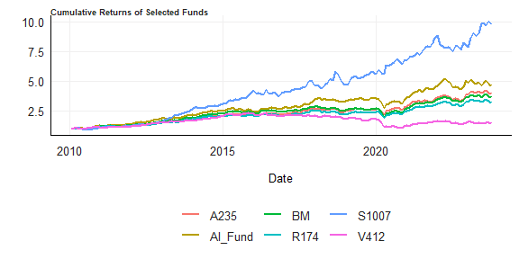

The goal of this README is to give a clear explanation behind the code I
provide in order to perform the Financial Econometrics practical, as
well as the thought processes which lead me to the specific code
selected or implemented.

``` r
rm(list = ls()) # Clean your environment:

gc() 
```

    ##          used (Mb) gc trigger (Mb) max used (Mb)
    ## Ncells 454107 24.3     975327 52.1   644242 34.5
    ## Vcells 819816  6.3    8388608 64.0  1634746 12.5

``` r
###

tinytex::install_tinytex(force = TRUE)
```

    ## tlmgr install elsarticle

``` r
options(repos = "https://cran.mirror.ac.za/")

###

library(tidyverse)
```

    ## Warning: package 'tidyverse' was built under R version 4.2.3

    ## Warning: package 'ggplot2' was built under R version 4.2.3

    ## Warning: package 'tibble' was built under R version 4.2.3

    ## Warning: package 'dplyr' was built under R version 4.2.3

    ## Warning: package 'lubridate' was built under R version 4.2.3

    ## ── Attaching core tidyverse packages ──────────────────────── tidyverse 2.0.0 ──
    ## ✔ dplyr     1.1.3     ✔ readr     2.1.4
    ## ✔ forcats   1.0.0     ✔ stringr   1.5.0
    ## ✔ ggplot2   3.4.2     ✔ tibble    3.2.1
    ## ✔ lubridate 1.9.2     ✔ tidyr     1.3.0
    ## ✔ purrr     1.0.1

    ## ── Conflicts ────────────────────────────────────────── tidyverse_conflicts() ──
    ## ✖ dplyr::filter() masks stats::filter()
    ## ✖ dplyr::lag()    masks stats::lag()
    ## ℹ Use the ]8;;http://conflicted.r-lib.org/conflicted package]8;; to force all conflicts to become errors

``` r
library(dplyr)

library(fmxdat)

library(rportfolios)
```

    ## Loading required package: truncdist

    ## Warning: package 'truncdist' was built under R version 4.2.3

    ## Loading required package: stats4
    ## Loading required package: evd

    ## Warning: package 'evd' was built under R version 4.2.3

``` r
library(PerformanceAnalytics)
```

    ## Loading required package: xts

    ## Warning: package 'xts' was built under R version 4.2.3

    ## Loading required package: zoo

    ## Warning: package 'zoo' was built under R version 4.2.3

    ## 
    ## Attaching package: 'zoo'
    ## 
    ## The following objects are masked from 'package:base':
    ## 
    ##     as.Date, as.Date.numeric
    ## 
    ## 
    ## ######################### Warning from 'xts' package ##########################
    ## #                                                                             #
    ## # The dplyr lag() function breaks how base R's lag() function is supposed to  #
    ## # work, which breaks lag(my_xts). Calls to lag(my_xts) that you type or       #
    ## # source() into this session won't work correctly.                            #
    ## #                                                                             #
    ## # Use stats::lag() to make sure you're not using dplyr::lag(), or you can add #
    ## # conflictRules('dplyr', exclude = 'lag') to your .Rprofile to stop           #
    ## # dplyr from breaking base R's lag() function.                                #
    ## #                                                                             #
    ## # Code in packages is not affected. It's protected by R's namespace mechanism #
    ## # Set `options(xts.warn_dplyr_breaks_lag = FALSE)` to suppress this warning.  #
    ## #                                                                             #
    ## ###############################################################################
    ## 
    ## Attaching package: 'xts'
    ## 
    ## The following objects are masked from 'package:dplyr':
    ## 
    ##     first, last
    ## 
    ## 
    ## Attaching package: 'PerformanceAnalytics'
    ## 
    ## The following object is masked from 'package:graphics':
    ## 
    ##     legend

``` r
library(RcppRoll)
```

    ## Warning: package 'RcppRoll' was built under R version 4.2.3

``` r
library(tbl2xts)

library(gridExtra)
```

    ## Warning: package 'gridExtra' was built under R version 4.2.3

    ## 
    ## Attaching package: 'gridExtra'
    ## 
    ## The following object is masked from 'package:dplyr':
    ## 
    ##     combine

``` r
library(cowplot)
```

    ## Warning: package 'cowplot' was built under R version 4.2.3

    ## 
    ## Attaching package: 'cowplot'
    ## 
    ## The following object is masked from 'package:lubridate':
    ## 
    ##     stamp

``` r
library(tbl2xts)

library(knitr)
```

    ## Warning: package 'knitr' was built under R version 4.2.3

``` r
library(fitHeavyTail)
```

    ## Warning: package 'fitHeavyTail' was built under R version 4.2.3

``` r
pacman::p_load(sugrrants, 
               rugarch)
```

# Question 1

``` r
# Importing data

rm(list = ls())

ASISA <- read_rds("data/ASISA_Rets.rds") %>% 
    filter(date >= as.Date("2010-01-31"))

BM <- read_rds("data/Capped_SWIX.rds") %>% 
    filter(date >= as.Date("2010-01-31")) %>% 
    select(-Tickers)

AIFund <- read_rds("data/AI_Max_Fund.rds") %>% 
    filter(date >= as.Date("2010-01-31"))

# Post global financial crisis. 
```

``` r
# Question exploration

unique(ASISA$Fund) # Too many funds to consider. 
```

    ##    [1] "K11"   "V22"   "M39"   "N40"   "O41"   "Q43"   "R44"   "Y51"   "B54"  
    ##   [10] "R70"   "T72"   "X76"   "C81"   "D82"   "E83"   "F84"   "G85"   "I87"  
    ##   [19] "K89"   "P94"   "R96"   "T98"   "A105"  "E109"  "H112"  "M117"  "R122" 
    ##   [28] "S123"  "D134"  "E135"  "I139"  "M143"  "O145"  "P146"  "S149"  "B158" 
    ##   [37] "D160"  "F162"  "G163"  "J166"  "O171"  "R174"  "V178"  "X180"  "Y181" 
    ##   [46] "E187"  "K193"  "Q199"  "X206"  "Y207"  "C211"  "F214"  "H216"  "I217" 
    ##   [55] "K219"  "O223"  "P224"  "V230"  "W231"  "Y233"  "A235"  "B236"  "D238" 
    ##   [64] "L246"  "M247"  "P250"  "Q251"  "Z260"  "D264"  "H268"  "I269"  "K271" 
    ##   [73] "L272"  "N274"  "O275"  "Q277"  "U281"  "V282"  "W283"  "Z286"  "B288" 
    ##   [82] "J296"  "L298"  "R304"  "D316"  "H320"  "M325"  "C341"  "K349"  "C367" 
    ##   [91] "I373"  "M377"  "T384"  "Y389"  "C393"  "E395"  "F396"  "K401"  "M403" 
    ##  [100] "P406"  "U411"  "V412"  "W413"  "Y415"  "A417"  "E421"  "F422"  "R434" 
    ##  [109] "V438"  "W439"  "X440"  "B444"  "Z468"  "G475"  "K479"  "L480"  "S487" 
    ##  [118] "Z494"  "H502"  "I503"  "G527"  "N534"  "W543"  "Z546"  "D550"  "F552" 
    ##  [127] "K557"  "E577"  "M585"  "P588"  "V594"  "Z598"  "A599"  "J608"  "K609" 
    ##  [136] "L610"  "S617"  "T618"  "U619"  "W621"  "X622"  "Y623"  "D628"  "G631" 
    ##  [145] "L636"  "N638"  "T644"  "V646"  "D654"  "G657"  "R668"  "S669"  "T670" 
    ##  [154] "X674"  "Y675"  "I685"  "Q693"  "U697"  "E707"  "G709"  "I711"  "M715" 
    ##  [163] "N716"  "O717"  "Q719"  "U723"  "V724"  "I737"  "J738"  "T748"  "A755" 
    ##  [172] "B756"  "E759"  "K765"  "L766"  "M767"  "N768"  "P770"  "T774"  "A781" 
    ##  [181] "B782"  "K791"  "L792"  "M793"  "O795"  "Q797"  "R798"  "V802"  "X804" 
    ##  [190] "A807"  "B808"  "C809"  "F812"  "H814"  "I815"  "J816"  "K817"  "L818" 
    ##  [199] "N820"  "P822"  "R824"  "S825"  "G839"  "I841"  "K843"  "M845"  "N846" 
    ##  [208] "W855"  "Z858"  "C861"  "K869"  "M871"  "T878"  "W881"  "X882"  "Y883" 
    ##  [217] "A885"  "C887"  "F890"  "N898"  "O899"  "U905"  "V906"  "A911"  "E915" 
    ##  [226] "G917"  "I919"  "L922"  "N924"  "O925"  "P926"  "Q927"  "R928"  "T930" 
    ##  [235] "U931"  "V932"  "W933"  "B938"  "C939"  "D940"  "I945"  "B964"  "C965" 
    ##  [244] "D966"  "A989"  "C991"  "H996"  "K999"  "N1002" "O1003" "P1004" "Q1005"
    ##  [253] "S1007" "J1024" "S1033" "U1035" "Z1040" "B1042" "C1043" "D1044" "H1048"
    ##  [262] "I1049" "J1050" "K1051" "L1052" "M1053" "P1056" "Q1057" "R1058" "S1059"
    ##  [271] "T1060" "U1061" "W1063" "X1064" "Y1065" "Z1066" "C1069" "G1073" "S383" 
    ##  [280] "L714"  "B626"  "B2"    "S45"   "L116"  "K141"  "D108"  "T410"  "S253" 
    ##  [289] "M221"  "T696"  "D810"  "O847"  "N170"  "X258"  "V334"  "G371"  "N1054"
    ##  [298] "S929"  "I1075" "P302"  "H658"  "S695"  "Y779"  "B28"   "C29"   "M455" 
    ##  [307] "K687"  "F1020" "B184"  "U229"  "E369"  "S513"  "B574"  "U307"  "X310" 
    ##  [316] "E655"  "A209"  "A729"  "Q771"  "W777"  "A79"   "H86"   "R226"  "D420" 
    ##  [325] "U775"  "G969"  "Z754"  "W257"  "N586"  "N612"  "F708"  "H762"  "J920" 
    ##  [334] "V74"   "F136"  "Q615"  "A651"  "B1068" "G189"  "Y441"  "P614"  "E681" 
    ##  [343] "S175"  "T176"  "J894"  "P354"  "C419"  "M637"  "G59"   "H242"  "Y597" 
    ##  [352] "Y701"  "T722"  "R1006" "E343"  "A365"  "H970"  "U73"   "I243"  "V256" 
    ##  [361] "E291"  "S305"  "W465"  "J634"  "R772"  "J114"  "A157"  "P380"  "E733" 
    ##  [370] "W907"  "E967"  "Q69"   "L194"  "J452"  "K1077" "I61"   "Y363"  "A443" 
    ##  [379] "U463"  "W491"  "R590"  "Y831"  "G1021" "G33"   "P328"  "Q329"  "R356" 
    ##  [388] "G423"  "I477"  "O509"  "H840"  "E473"  "F1072" "J88"   "L454"  "X24"  
    ##  [397] "K115"  "X128"  "V308"  "R330"  "Q849"  "L1026" "M299"  "R850"  "V360" 
    ##  [406] "B418"  "Y935"  "W127"  "C237"  "U385"  "D394"  "I399"  "U541"  "B600" 
    ##  [415] "F760"  "Y805"  "N66"   "J582"  "E31"   "H60"   "M91"   "W153"  "T202" 
    ##  [424] "V204"  "J270"  "O301"  "X336"  "K375"  "C575"  "D576"  "I581"  "C679" 
    ##  [433] "L688"  "R720"  "N742"  "O743"  "L896"  "N976"  "Y25"   "V386"  "J686" 
    ##  [442] "R18"   "N196"  "I347"  "U879"  "P198"  "Z624"  "V698"  "F734"  "J868" 
    ##  [451] "T46"   "G111"  "H138"  "J192"  "O249"  "Q303"  "O379"  "X570"  "Z676" 
    ##  [460] "D732"  "V958"  "Q95"   "Q147"  "A287"  "F578"  "D524"  "O535"  "Q979" 
    ##  [469] "D290"  "I607"  "X414"  "C731"  "Q17"   "I35"   "Y77"   "Y129"  "C185" 
    ##  [478] "D368"  "J374"  "O405"  "Q537"  "N664"  "K713"  "Q745"  "L38"   "W75"  
    ##  [487] "P692"  "H710"  "P796"  "D836"  "P900"  "L90"   "Q121"  "F188"  "G319" 
    ##  [496] "F656"  "K739"  "C783"  "U853"  "H944"  "W101"  "Z182"  "R200"  "B730" 
    ##  [505] "A963"  "M481"  "I555"  "Y571"  "Z910"  "O1055" "T254"  "W647"  "Z650" 
    ##  [514] "Z702"  "G735"  "U801"  "U177"  "L350"  "Z416"  "I633"  "D888"  "B912" 
    ##  [523] "I971"  "S19"   "A53"   "O197"  "X232"  "W309"  "P848"  "P874"  "T20"  
    ##  [532] "G215"  "X284"  "J348"  "G397"  "H398"  "F682"  "U99"   "B392"  "V854" 
    ##  [541] "A937"  "C3"    "L64"   "G241"  "D342"  "Z390"  "W517"  "F942"  "R252" 
    ##  [550] "P276"  "E551"  "F994"  "F6"    "J36"   "C445"  "P536"  "V672"  "D680" 
    ##  [559] "D4"    "L12"   "P16"   "W49"   "O67"   "L324"  "H346"  "Y467"  "B678" 
    ##  [568] "E863"  "E1045" "U21"   "I165"  "L506"  "X596"  "O665"  "G683"  "W803" 
    ##  [577] "B990"  "M1079" "W829"  "H8"    "C107"  "Y259"  "O327"  "F344"  "W673" 
    ##  [586] "I789"  "K921"  "Y103"  "N378"  "J426"  "B470"  "F500"  "Z728"  "F1046"
    ##  [595] "N248"  "P562"  "H918"  "I1023" "R148"  "D212"  "J478"  "R512"  "A677" 
    ##  [604] "G865"  "H866"  "F240"  "J322"  "V516"  "B522"  "F786"  "E239"  "S747" 
    ##  [613] "T826"  "Y857"  "Y909"  "W1037" "G579"  "E993"  "H294"  "A521"  "X648" 
    ##  [622] "I763"  "Z780"  "Q823"  "U47"   "K973"  "B80"   "U333"  "Q563"  "E837" 
    ##  [631] "O977"  "P120"  "H164"  "Q225"  "F318"  "O561"  "P718"  "X830"  "C913" 
    ##  [640] "M65"   "C263"  "F266"  "G267"  "Q407"  "R408"  "V620"  "B704"  "N872" 
    ##  [649] "P42"   "B210"  "J218"  "T228"  "S409"  "S591"  "R694"  "T800"  "C835" 
    ##  [658] "R278"  "W335"  "Y337"  "L428"  "S461"  "R564"  "Y727"  "U203"  "J244" 
    ##  [667] "M273"  "Q355"  "U437"  "D446"  "F916"  "R1032" "H1074" "Y493"  "E603" 
    ##  [676] "S97"   "E317"  "A391"  "Z520"  "L168"  "T306"  "G345"  "U645"  "K1025"
    ##  [685] "E5"    "H34"   "N352"  "O353"  "F474"  "K505"  "G1047" "Z962"  "S71"  
    ##  [694] "Z234"  "B262"  "S279"  "H372"  "B496"  "P68"   "A573"  "E629"  "M663" 
    ##  [703] "C705"  "F838"  "X908"  "X934"  "V1062" "A1067" "L1078" "J140"  "B366" 
    ##  [712] "R382"  "O613"  "K63"   "F110"  "L220"  "C497"  "J504"  "W569"  "Q589" 
    ##  [721] "H892"  "N456"  "C549"  "G761"  "Z156"  "D186"  "L376"  "D602"  "E785" 
    ##  [730] "K895"  "Y1039" "W23"   "A27"   "W179"  "F370"  "P484"  "U671"  "H684" 
    ##  [739] "J842"  "X856"  "G995"  "V100"  "W725"  "V1010" "W1011" "D706"  "J764" 
    ##  [748] "V1036" "F32"   "J62"   "N144"  "E161"  "S227"  "M351"  "M689"  "N690" 
    ##  [757] "A183"  "G293"  "C523"  "K661"  "X726"  "F864"  "E889"  "L948"  "Y961" 
    ##  [766] "A1"    "L584"  "S799"  "T982"  "T124"  "C159"  "H580"  "F604"  "L740" 
    ##  [775] "K37"   "B106"  "Y311"  "O691"  "V828"  "M1001" "B1016" "E1071" "P1082"
    ##  [784] "Q1083" "R1084" "H190"  "Z312"  "K245"  "R616"  "P640"  "Z832"  "G943" 
    ##  [793] "L1000" "D472"  "T488"  "U489"  "X778"  "X492"  "L662"  "M897"  "Y155" 
    ##  [802] "S201"  "A469"  "A703"  "D1018" "N404"  "C471"  "J556"  "D784"  "P978" 
    ##  [811] "A261"  "N300"  "N326"  "S331"  "P432"  "O457"  "A495"  "J712"  "M819" 
    ##  [820] "X960"  "Z26"   "V48"   "Z130"  "F292"  "J1076" "N430"  "R486"  "E499" 
    ##  [829] "O587"  "J972"  "F58"   "V152"  "H554"  "K635"  "R746"  "K947"  "Q953" 
    ##  [838] "U957"  "O15"   "C601"  "C627"  "J400"  "P458"  "O821"  "A1015" "X154" 
    ##  [847] "Q485"  "Z572"  "L844"  "T280"  "B652"  "I867"  "M923"  "Z338"  "L402" 
    ##  [856] "T462"  "G787"  "N794"  "T904"  "Z936"  "G7"    "F448"  "S565"  "A859" 
    ##  [865] "Q901"  "L974"  "M1027" "X50"   "O93"   "A131"  "E213"  "Y285"  "T358" 
    ##  [874] "Q433"  "A547"  "U593"  "S721"  "X752"  "O769"  "F968"  "V984"  "D1070"
    ##  [883] "O1081" "C289"  "A339"  "N508"  "O639"  "Q641"  "P666"  "U749"  "O951" 
    ##  [892] "Z988"  "N118"  "G137"  "H736"  "V776"  "E941"  "N950"  "K323"  "Z442" 
    ##  [901] "H476"  "K531"  "H632"  "M741"  "D992"  "C315"  "U359"  "Y545"  "N560" 
    ##  [910] "W959"  "N14"   "N222"  "I425"  "M429"  "V464"  "E525"  "F526"  "U567" 
    ##  [919] "A313"  "H450"  "Y519"  "B314"  "J790"  "R954"  "S955"  "Z1014" "G501" 
    ##  [928] "D758"  "S903"  "E57"   "X362"  "S435"  "X700"  "C757"  "G813"  "O873" 
    ##  [937] "V880"  "B340"  "M559"  "Q667"  "U827"  "E265"  "E447"  "O483"  "M533" 
    ##  [946] "A833"  "D862"  "N1080" "Z52"   "M195"  "R460"  "Z806"  "O431"  "Y649" 
    ##  [955] "W985"  "O1029" "Q173"  "W361"  "Q459"  "V568"  "D914"  "X1038" "D56"  
    ##  [964] "H788"  "C133"  "S539"  "T540"  "R980"  "S981"  "N1028" "O119"  "U255" 
    ##  [973] "X388"  "G449"  "L558"  "K583"  "H606"  "S851"  "T852"  "I893"  "R902" 
    ##  [982] "C1017" "T1034" "B132"  "K167"  "T436"  "B548"  "P744"  "X986"  "A1041"
    ##  [991] "N92"   "I529"  "F630"  "C653"  "V750"  "M949"  "T150"  "V490"  "M507" 
    ## [1000] "J530"  "R876"  "M975"  "Q1031" "X466"  "U515"  "W751"  "Y987"  "L142" 
    ## [1009] "P510"  "P952"  "S1085" "T332"  "W387"  "N482"  "R538"  "Y753"  "L870" 
    ## [1018] "U1009" "Z208"  "D498"  "B834"  "S877"  "B886"  "M13"   "I191"  "W595" 
    ## [1027] "Q875"  "I997"  "J998"  "H424"  "H528"  "R642"  "H1022" "I295"  "K453" 
    ## [1036] "T514"  "X544"  "J946"  "I9"    "X102"  "K297"  "P1030" "M169"  "L532" 
    ## [1045] "T956"  "W205"  "S357"  "G605"  "W699"  "E1019" "T1086" "G553"  "S643" 
    ## [1054] "U125"  "V126"  "I659"  "J660"  "S773"  "X1012" "Y1013" "Z364"  "V542" 
    ## [1063] "M611"  "U983"  "J10"   "C55"   "Z78"   "Z104"  "U151"  "K427"  "T592" 
    ## [1072] "A625"  "D30"   "T566"  "B860"

``` r
# I am going to select the best and worst performing index and active funds separately. 

# Not all funds have the same starting date as my AI... 

# I am selecting only funds that at least have a minimum date of 2010 and must have a maximum date of 2023. This excludes funds that do not exist over the entire sample period. 

ASISA <-
  ASISA %>%
  group_by(Fund) %>%
  filter(min(date) == as.Date("2010-01-31") & 
             max(date) == as.Date("2023-09-30")) %>%
  ungroup()

# Which funds perform best?

# Best Performing fund that is an index: A235
       # 0.00903

ASISA %>%
  filter(Index == "Yes") %>%
  group_by(Fund) %>%
  summarise(avg_returns = mean(Returns, na.rm = TRUE)) %>%
  arrange(desc(avg_returns)) %>%
  slice(1)
```

    ## # A tibble: 1 × 2
    ##   Fund  avg_returns
    ##   <chr>       <dbl>
    ## 1 A235      0.00903

``` r
# Worst performing Index Fund: R174
        # -0.00786

ASISA %>%
  filter(Index == "Yes") %>%
  group_by(Fund) %>%
  summarise(avg_returns = mean(Returns, na.rm = TRUE)) %>%
  arrange(avg_returns) %>%
  slice(1)
```

    ## # A tibble: 1 × 2
    ##   Fund  avg_returns
    ##   <chr>       <dbl>
    ## 1 R174      0.00786

``` r
# Best Performing Active Fund: S1007 (also best performing fund in general)
       # 0.0148

ASISA %>%
  filter(Index == "No") %>%
  group_by(Fund) %>%
  summarise(avg_returns = mean(Returns, na.rm = TRUE)) %>%
  arrange(desc(avg_returns)) %>%
  slice(1)
```

    ## # A tibble: 1 × 2
    ##   Fund  avg_returns
    ##   <chr>       <dbl>
    ## 1 S1007      0.0148

``` r
# Worst performing Active Fund: V412 (and worst overall)
        # 0.00312

ASISA %>%
  filter(Index == "No") %>%
  group_by(Fund) %>%
  summarise(avg_returns = mean(Returns, na.rm = TRUE)) %>%
  arrange(avg_returns) %>%
  slice(1)
```

    ## # A tibble: 1 × 2
    ##   Fund  avg_returns
    ##   <chr>       <dbl>
    ## 1 V412      0.00312

``` r
# Selection: 

Selected_Funds <- c("V412","S1007", "R174", "A235")

ASISA <- ASISA %>% 
    filter(Fund %in% Selected_Funds)

# I now only consider funds that have performed the best and worst, to frame the comparison better to my AI fund. 
```

``` r
library(ggplot2)

### I want to plot all return distributions on the same set of axes. 

wide_format_ASISA <- ASISA %>% 
    select(c(Fund, Returns, date)) %>%
    spread(Fund, Returns)

joined_data <- left_join(BM, AIFund,
                         by = "date") %>%
               left_join(., wide_format_ASISA,
                         by = "date")

joined_data$BM <- joined_data$Returns 

###

fee1 <- 0.025/12 # 2.5% fee per month annualized. (active managers)

fee2 <- 0.01/12 # 1% fee per month annualised. (index funds)
```

``` r
# Distribution of active fund returns against my AI Fund. 

ggplot(joined_data) +
  geom_density(aes(x = (S1007 - fee1), 
                   fill = "S1007"), 
                   alpha = 0.45) +
  geom_density(aes(x = AI_Fund, 
                   fill = "AI Fund"), 
                   alpha = 0.65) +
  geom_density(aes(x = (V412 - fee1), 
                   fill = "V412"), 
                   alpha = 0.45) +
  labs(title = "AI vs Active Managers",
       y = "",
       x = "") +
  theme_fmx() +
  scale_fill_manual(values = c("yellow", "blue", "blue4"), 
                    name = "Variables") +
  guides(fill = guide_legend(title = "Variables")) +
    xlim(c(-0.15,0.2)) +
    theme_fmx(title.size = ggpts(25), 
              CustomCaption = F)
```


<p class="caption">
</p>

``` r
# Distribution of index fund returns against my AI Fund. 

ggplot(joined_data) +
  geom_density(aes(x = (R174 - fee2), 
                   fill = "R174"), 
                   alpha = 0.45) +
  geom_density(aes(x = AI_Fund, 
                   fill = "AI Fund"), 
                   alpha = 0.65) +
  geom_density(aes(x = (A235 - fee2), 
                   fill = "A235"), 
                   alpha = 0.45) +
  labs(title = "AI vs Index Funds",
       y = "",
       x = "") +
  theme_fmx() +
  scale_fill_manual(values = c("yellow", "blue", "blue4"), 
                    name = "Variables") +
  guides(fill = guide_legend(title = "Variables")) +
    xlim(c(-0.15,0.2)) +
    theme_fmx(title.size = ggpts(25), 
              CustomCaption = F)
```


<p class="caption">
</p>

``` r
# Distribution of benchmark returns against my AI Fund. 

ggplot(joined_data) +
  geom_density(aes(x = AI_Fund, 
                   fill = "AI Fund"), 
                   alpha = 0.65) +
  geom_density(aes(x = BM, 
                   fill = "Benchmark"),
                   alpha = 0.45) +
  labs(title = "AI vs Capped SWIX",
       y = "",
       x = "") +
  theme_fmx() +
  scale_fill_manual(values = c("yellow", "blue", "blue4"), 
                    name = "Variables") +
  guides(fill = guide_legend(title = "Variables")) +
    xlim(c(-0.15,0.2)) +
    theme_fmx(title.size = ggpts(25), 
              CustomCaption = F)
```


<p class="caption">
</p>

``` r
# Get data into the correct format. 

long_format_data <- joined_data %>% 
                    select(-Returns) %>%
                    pivot_longer(-date, 
                                 names_to = "Tickers", 
                                 values_to = "Returns")
```

``` r
# Cumulative returns of selected funds

long_format_data %>%  
arrange(date) %>%   
    group_by(Tickers) %>%   
    
mutate(Rets = coalesce(Returns, 0)) %>%   
mutate(CP = cumprod(1 + Rets)) %>%   
    
ungroup() %>%  
    
ggplot() + 
geom_line(aes(date, 
              CP, 
              color = Tickers), 
          alpha = 1, 
          size = 1) + 
    xlab("Date") +
    ylab("") +
labs(title = "Cumulative Returns of Selected Funds") + 
    theme_fmx(title.size = ggpts(20), 
              CustomCaption = F)
```


<p class="caption">
</p>

``` r
# 3 year Rolling returns of selected funds. 

library(RcppRoll)

plotdf <- long_format_data %>%
    group_by(Tickers) %>% 
    
    mutate(
        
        RollRets = RcppRoll::roll_prod(1 + Returns, 
                                       36, 
                                       fill = NA, 
                                       align = "right")^(12/36) - 1
        
        ) %>% 
    group_by(date) %>% 
    filter(any(!is.na(RollRets))) %>%   
    ungroup()

g <- 
plotdf |>  
ggplot() + 
geom_line(aes(date, 
              RollRets, 
              color = Tickers), 
              alpha = 1, 
              size = 1) + 
labs(title = "Rolling 3-Year Returns", 
     subtitle = "", x = "", y = "", 
     caption = "") + 
theme_fmx(title.size = ggpts(20), 
          CustomCaption = F) + 
    
fmx_cols()

finplot(g, x.date.dist = "1 year", 
        x.date.type = "%Y", 
        x.vert = T, 
        y.pct = T, 
        y.pct_acc = 1)
```


<p class="caption">
</p>

``` r
# rolling standard deviation of selected funds. 

plot_dlog <- long_format_data %>% 
  mutate(YM = format(date, "%Y%B")) %>%   
  arrange(date) %>%   
  group_by(Tickers, YM) %>% 
  filter(date == last(date)) %>%   
  group_by(Tickers) %>%  
  mutate(
      
      RollSD = RcppRoll::roll_sd(
          
          1 + Returns, 36, fill = NA, align = "right") * sqrt(12)
      
      ) %>%   
filter(!is.na(RollSD))

g <- 
plot_dlog %>%   
ggplot() + 
geom_line(aes(date,
              RollSD, 
              color = Tickers),
              alpha = 1, 
              size = 1) + 
labs(title = "Rolling Standard Deviation") + 
    theme_fmx(title.size = ggpts(20),
              CustomCaption = F) + 
    
fmx_cols()

finplot(g, x.date.dist = "1 year", 
        x.date.type = "%Y",
        x.vert = T, 
        y.pct = T,
        y.pct_acc = 1)
```


<p class="caption">
</p>

# Question 2

``` r
rm(list = ls())

gc()
```

    ##           used  (Mb) gc trigger  (Mb) max used  (Mb)
    ## Ncells 2998184 160.2    6099051 325.8  6099051 325.8
    ## Vcells 4960385  37.9   10146329  77.5  8388556  64.0

``` r
Indexes <- read_rds("data/Cncy_Hedge_Assets.rds")

# ALBI is bonds (local)
# J433 is equities (local)
# bbg agg is Bloomberg bond aggregation. (foreign)
# msci acwi is equities. (foreign)

ZAR <- read_rds("data/Monthly_zar.rds") %>% 
    filter(date >= as.Date(
        first(
            Indexes$date))) %>%
    select(-Tickers)

### How much should I hold in this portfolio given that I need a 60/40 split between equity/bonds and a 70/30 split between local/global split?

# for ALBI: 0.4 * 0.7 = 0.28
# for J433: 0.6 * 0.7 = 0.42
# for BBG: 0.4 * 0.3 = 0.12
# for MSCI: 0.6 * 0.3 = 0.18

# This sums to one. 

Weights <- c(0.18, 0.12, 0.42, 0.28)

Weights_Indexed <- Weights * (Indexes %>% select(-date))

Weights_Indexed$date <- Indexes$date

Weights_Indexed <- Weights_Indexed %>% slice(-1)

###

# Add a portfolio return column:

Weights_Indexed <- Weights_Indexed %>% 
    mutate(PortRet = rowSums(Weights_Indexed %>% select(-date)))

ZAR <- ZAR %>% 
    mutate(ZarRet = value/lag(value) - 1) %>% 
    slice(-1)

###

RetData <- as.data.frame( cbind(Weights_Indexed$PortRet, ZAR$ZarRet)) %>% 
    rename(PortRet = V1) %>% 
    rename(ZARRet = V2) %>% 
    na.omit(.)
```

``` r
# Some calculations of %
# I continually changed the directions of these greater than signs. 

(RetData %>% 
    filter(PortRet > 0, ZARRet < 0) %>% 
    nrow(.))/nrow(RetData)*100
```

    ## [1] 43.79845

``` r
# 20.16% top right 
# 9.31% bottom left corner 
# 26.36% bottom right.
# 43.79% top left. 
```

``` r
# Trying my best to perfectly replicate the findings in the study, and to make the graph look as good as possible. 

ggplot(RetData, 
       aes(x = ZARRet, y = PortRet)) +
    annotate("rect", # annotate adds squares
             xmin = -Inf, 
             xmax = 0, 
             ymin = -Inf, 
             ymax = 0, 
             fill = "red", 
             alpha = 0.18) +
    annotate("rect", 
             xmin = 0, 
             xmax = Inf, 
             ymin = -Inf, 
             ymax = 0, 
             fill = "lightblue", 
             alpha = 0.2) +
    annotate("rect", 
             xmin = -Inf,
             xmax = 0, 
             ymin = 0, 
             ymax = Inf,
             fill = "pink", 
             alpha = 0.2) +
    annotate("rect", 
             xmin = 0,
             xmax = Inf, 
             ymin = 0, 
             ymax = Inf, 
             fill = "blue", 
             alpha = 0.18) +
    geom_point(color = "steelblue4", 
               alpha = 0.45) +
    geom_smooth(method = "lm", # Line of best fit
                se = TRUE, 
                color = "grey") + 
  labs(title = "Scatter Plot of Return Correlation",
       x = "Portfolio",
       y = "ZAR/USD") +
    geom_vline(xintercept = -0.025, # 2.5% cost of hedging (based on origin)
               linetype = "dotted", 
               color = "black", 
               alpha = 0.5, 
               size = 1) +
    xlim(c(-0.2, 0.2)) +  # same as original
    ylim(c(-0.2, 0.2)) +  # same as original
    geom_label(aes(x = -0.1, 
                   y = 0.1, 
                   label = "43.79%"), # labeling the % calculated per area
               fill = "white", 
               color = "black") +
    geom_label(aes(x = 0.1, 
                   y = 0.1, 
                   label = "20.16%"), 
               fill = "white", 
               color = "black") +
    geom_label(aes(x = -0.1,
                   y = -0.1, 
                   label = "9.31%"), 
               fill = "white", 
               color = "black") +
  geom_label(aes(x = 0.1, 
                 y = -0.1, 
                 label = "26.36"), 
             fill = "white", 
             color = "black") +
  theme_bw() # this looked best for this plot. 
```

    ## `geom_smooth()` using formula = 'y ~ x'


<p class="caption">
</p>

``` r
# Could not add densities at the top and side of ggplot the way original paper did, so I added them separately instead. 

ggplot(RetData, 
       aes(x = ZARRet, 
           fill = "ZAR/USD")) +
  geom_density(alpha = 0.5) +
  geom_density(aes(x = PortRet, 
                   fill = "Portfolio"), 
                   alpha = 0.5) +
  labs(title = "Distribution of Returns",
       x = "",
       y = "") +
  scale_fill_manual(name = "",
                    values = c("ZAR/USD" = "green",
                               "Portfolio" = "blue")) +
    xlim(c(-0.1,0.15)) +
  theme(legend.position = "bottom")
```


<p class="caption">
</p>

``` r
# restart for organisation purposes.

rm(list = ls())

gc()
```

    ##           used  (Mb) gc trigger  (Mb) max used  (Mb)
    ## Ncells 3048412 162.9    6099051 325.8  6099051 325.8
    ## Vcells 5040196  38.5   12255594  93.6  8388556  64.0

``` r
###

Indexes <- read_rds("data/Cncy_Hedge_Assets.rds") 

ZAR <- read_rds("data/Monthly_zar.rds") %>% 
    filter(date >= as.Date(first(Indexes$date))) %>%
    select(-Tickers)

Weights <- c(0.18, 0.12, 0.42, 0.28)

### Plain ole re balancing portfolio.

RebalancedData <- Return.portfolio(
    Indexes, weights = Weights, rebalance_on = "quarters") %>% 
    xts_tbl(.) %>% 
    mutate(RollSD = RcppRoll::roll_sd(1 + portfolio.returns, 
                                      36, 
                                      fill = NA, 
                                      align = "right") * sqrt(12)) %>%  
                                      filter(!is.na(RollSD))

### Portfolio Including Rand

ZAR <- ZAR %>% 
    mutate(ZarRet = value/lag(value) - 1) %>% 
    filter(date >= "2005-01-31") 

RandRebalance <- RebalancedData %>% 
    mutate(Hedged = (0.9*portfolio.returns + 0.1*ZAR$ZarRet))

# I assume this is incredibly dubious, but I could not figure out another way to argue that I am holding a portfolio that re balances every quarter, and is exposed to 10% of the Rand, so I did this weighted average. 

RandRebalance <- RandRebalance %>% 
    mutate(RollSDHedged = RcppRoll::roll_sd(1 + Hedged, 
                                      36, 
                                      fill = NA, 
                                      align = "right") * sqrt(12)) %>%  
                                      filter(!is.na(RollSDHedged)) %>% 
    select(date, 
           RollSD,
           RollSDHedged) 

###

# rolling standard deviation

g <- RandRebalance %>%
  ggplot(aes(x = date)) +
  geom_line(aes(y = RollSD, color = "Excluding Rand"), size = 1) +
  geom_line(aes(y = RollSDHedged, color = "Including Rand"), size = 1) +
  labs(title = "Rolling Volatility",
       x = "Date",
       y = "Standard Deviation") +
  scale_color_manual(values = c("Excluding Rand" = "red", 
                                "Including Rand" = "red4")) +
    theme_fmx(title.size = ggpts(30),
              CustomCaption = F)
```

``` r
finplot(g, 
        x.date.dist = "1 year", 
        x.date.type = "%Y", 
        x.vert = T, 
        y.pct = T, 
        y.pct_acc = 1)
```


<p class="caption">
</p>

# Question 3

``` r
rm(list = ls())

gc() 
```

    ##           used  (Mb) gc trigger  (Mb) max used  (Mb)
    ## Ncells 3063546 163.7    6099051 325.8  6099051 325.8
    ## Vcells 5072364  38.7   12255594  93.6  8388556  64.0

``` r
# Loading in data

ALSI <- read_rds("data/ALSI.rds")

RebDays <- read_rds("data/Rebalance_days.rds") %>% 
    filter(date >= first(ALSI$date) & 
               Date_Type == "Effective Date" &
               date <= last(ALSI$date))

pacman::p_load(tbl2xts, PerformanceAnalytics)

###

# Both of these functions essentially wrap elements of the practicals offered by Nico inside functions, so that I can easily answer the question at hand. It is not necessarily "unique" code, but it works. You can go to the file locations to examine the functions in greater detail. 

source('Question 3/code/PortReturn.R')

source('Question 3/code/Proportional_Cap_Foo.R')
```

``` r
# Simply want to find high volatility years for the ZAR and add them to the ggplots later. I have chosen not to stratify; time pressure is a factor but also, I think that the graph at the end of this will be pretty neat. 

ZAR <- read_rds("data/Monthly_zar.rds") %>%
    select(-Tickers) %>% 
    mutate(Return = value/lag(value) - 1) %>% 
    filter(date >= first(ALSI$date)) %>% 
    select(-c(value)) %>% 
    na.omit()

ZARSD <- ZAR %>% 
  
  mutate(Year = format(date, "%Y")) %>% 
  
  group_by(Year) %>% summarise(SD = sd(Return)*sqrt(12)) %>% 
  
  mutate(TopQtile = quantile(SD, 0.67),
         BotQtile = quantile(SD, 0.33))

Hi_Vol <- ZARSD %>% filter(SD > TopQtile) %>% pull(Year)

# 2016, 2018, 2020, and 2023 are high volatility years. 

Low_Vol <- ZARSD %>% filter(SD < BotQtile) %>% pull(Year)

# 2014, 2015, 2017, 2021 are low volatility years. 
```

``` r
# Even though I only use it once, i decided that a PortReturn function would be best suited to this question because of how many times it had to be rerun and edited. Essentially, a function that takes a data set and performs large parts of the portfolio returns process outlined in the practical about portfolio creation and returns. 

Indexes <- ALSI %>%  pull(Index_Name) %>% na.omit(.) %>%  unique()

IndRet <- list()

# I want to estimate rolling returns instead, because I think for such similar funds, this will allow us to see a fair representation of their returns. 

for(i in 1:length(Indexes)){
    
    # use the PortReturn() function:
 
    IndRet[[i]] <- PortReturn(ALSI,index = Indexes[i]) %>% 
        group_by(Methodod) %>% 
    mutate(RollRets = RcppRoll::roll_prod(1 + Returns, 
                                          36, 
                                          fill = NA, 
                                          align = "right")^(12/36) - 1) %>%   
    group_by(date) %>%   
    filter(any(!is.na(RollRets))) %>%
    mutate(Index = Indexes[i])
}
```

    ## Warning in left_join(., J203BPValue %>% gather(Tickers, value_held, -date), : Detected an unexpected many-to-many relationship between `x` and `y`.
    ## ℹ Row 1 of `x` matches multiple rows in `y`.
    ## ℹ Row 1 of `y` matches multiple rows in `x`.
    ## ℹ If a many-to-many relationship is expected, set `relationship =
    ##   "many-to-many"` to silence this warning.

    ## Warning in left_join(., J203Cont %>% gather(Tickers, Contribution, -date), : Detected an unexpected many-to-many relationship between `x` and `y`.
    ## ℹ Row 1 of `x` matches multiple rows in `y`.
    ## ℹ Row 1 of `y` matches multiple rows in `x`.
    ## ℹ If a many-to-many relationship is expected, set `relationship =
    ##   "many-to-many"` to silence this warning.

    ## Warning in left_join(., J403BPValue %>% gather(Tickers, value_held, -date), : Detected an unexpected many-to-many relationship between `x` and `y`.
    ## ℹ Row 1 of `x` matches multiple rows in `y`.
    ## ℹ Row 1 of `y` matches multiple rows in `x`.
    ## ℹ If a many-to-many relationship is expected, set `relationship =
    ##   "many-to-many"` to silence this warning.

    ## Warning in left_join(., J403Cont %>% gather(Tickers, Contribution, -date), : Detected an unexpected many-to-many relationship between `x` and `y`.
    ## ℹ Row 1 of `x` matches multiple rows in `y`.
    ## ℹ Row 1 of `y` matches multiple rows in `x`.
    ## ℹ If a many-to-many relationship is expected, set `relationship =
    ##   "many-to-many"` to silence this warning.

    ## Warning in left_join(., J203BPValue %>% gather(Tickers, value_held, -date), : Detected an unexpected many-to-many relationship between `x` and `y`.
    ## ℹ Row 1 of `x` matches multiple rows in `y`.
    ## ℹ Row 2666 of `y` matches multiple rows in `x`.
    ## ℹ If a many-to-many relationship is expected, set `relationship =
    ##   "many-to-many"` to silence this warning.

    ## Warning in left_join(., J203Cont %>% gather(Tickers, Contribution, -date), : Detected an unexpected many-to-many relationship between `x` and `y`.
    ## ℹ Row 1 of `x` matches multiple rows in `y`.
    ## ℹ Row 2666 of `y` matches multiple rows in `x`.
    ## ℹ If a many-to-many relationship is expected, set `relationship =
    ##   "many-to-many"` to silence this warning.

    ## Warning in left_join(., J403BPValue %>% gather(Tickers, value_held, -date), : Detected an unexpected many-to-many relationship between `x` and `y`.
    ## ℹ Row 1 of `x` matches multiple rows in `y`.
    ## ℹ Row 2666 of `y` matches multiple rows in `x`.
    ## ℹ If a many-to-many relationship is expected, set `relationship =
    ##   "many-to-many"` to silence this warning.

    ## Warning in left_join(., J403Cont %>% gather(Tickers, Contribution, -date), : Detected an unexpected many-to-many relationship between `x` and `y`.
    ## ℹ Row 1 of `x` matches multiple rows in `y`.
    ## ℹ Row 2666 of `y` matches multiple rows in `x`.
    ## ℹ If a many-to-many relationship is expected, set `relationship =
    ##   "many-to-many"` to silence this warning.

    ## Warning in left_join(., J203BPValue %>% gather(Tickers, value_held, -date), : Detected an unexpected many-to-many relationship between `x` and `y`.
    ## ℹ Row 1 of `x` matches multiple rows in `y`.
    ## ℹ Row 198856 of `y` matches multiple rows in `x`.
    ## ℹ If a many-to-many relationship is expected, set `relationship =
    ##   "many-to-many"` to silence this warning.

    ## Warning in left_join(., J203Cont %>% gather(Tickers, Contribution, -date), : Detected an unexpected many-to-many relationship between `x` and `y`.
    ## ℹ Row 1 of `x` matches multiple rows in `y`.
    ## ℹ Row 198856 of `y` matches multiple rows in `x`.
    ## ℹ If a many-to-many relationship is expected, set `relationship =
    ##   "many-to-many"` to silence this warning.

    ## Warning in left_join(., J403BPValue %>% gather(Tickers, value_held, -date), : Detected an unexpected many-to-many relationship between `x` and `y`.
    ## ℹ Row 1 of `x` matches multiple rows in `y`.
    ## ℹ Row 198856 of `y` matches multiple rows in `x`.
    ## ℹ If a many-to-many relationship is expected, set `relationship =
    ##   "many-to-many"` to silence this warning.

    ## Warning in left_join(., J403Cont %>% gather(Tickers, Contribution, -date), : Detected an unexpected many-to-many relationship between `x` and `y`.
    ## ℹ Row 1 of `x` matches multiple rows in `y`.
    ## ℹ Row 198856 of `y` matches multiple rows in `x`.
    ## ℹ If a many-to-many relationship is expected, set `relationship =
    ##   "many-to-many"` to silence this warning.

``` r
names(IndRet) <- Indexes

indices_roll_ret <- rbind(IndRet[[1]],
                          IndRet[[2]], 
                          IndRet[[3]]) %>% 
    arrange(date)
    
### Make Plots

    # Earlier, I created the vectors of high volatility and low volatility dates of the rand. These will now be used to construct ranges that can further be used in a ggplot object to create shaded regions of high volatility and low volatility. 

# Ranges: 

   # High Vol

HV1 <- data.frame(
  xmin = as.Date("2016-01-01"),
  xmax = as.Date("2016-12-01"),
  ymin = -Inf,
  ymax = Inf
)

HV2 <- data.frame(
  xmin = as.Date("2018-01-01"),
  xmax = as.Date("2018-12-01"),
  ymin = -Inf,
  ymax = Inf
)

HV3 <- data.frame(
  xmin = as.Date("2020-01-01"),
  xmax = as.Date("2020-12-01"),
  ymin = -Inf,
  ymax = Inf
)

HV4 <- data.frame(
  xmin = as.Date("2023-01-01"),
  xmax = as.Date("2023-12-01"),
  ymin = -Inf,
  ymax = Inf
)

# Low vol 

LV1 <- data.frame(
  xmin = as.Date("2014-01-01"),
  xmax = as.Date("2014-12-01"),
  ymin = -Inf,
  ymax = Inf
)

LV2 <- data.frame(
  xmin = as.Date("2015-01-01"),
  xmax = as.Date("2015-12-01"),
  ymin = -Inf,
  ymax = Inf
)

LV3 <- data.frame(
  xmin = as.Date("2017-01-01"),
  xmax = as.Date("2017-12-01"),
  ymin = -Inf,
  ymax = Inf
)

LV4 <- data.frame(
  xmin = as.Date("2021-01-01"),
  xmax = as.Date("2021-12-01"),
  ymin = -Inf,
  ymax = Inf
)

###

alpha = 0.2 # so that all shaded regions are consistent. 
```

``` r
# I should have made a function.

# Large cap stocks

Large <- indices_roll_ret %>% 
     filter(Index == "Large_Caps") %>% 
        ggplot() +
    geom_rect(data = HV1, 
              aes(xmin = xmin, 
                  xmax = xmax, 
                  ymin = ymin, 
                  ymax = ymax), 
              fill = "red4", 
              alpha = alpha) +
    geom_rect(data = HV2, 
              aes(xmin = xmin, 
                  xmax = xmax, 
                  ymin = ymin, 
                  ymax = ymax), 
              fill = "red4", 
              alpha = alpha) +
    geom_rect(data = HV3, 
              aes(xmin = xmin, 
                  xmax = xmax, 
                  ymin = ymin, 
                  ymax = ymax), 
              fill = "red4", 
              alpha = alpha) +
    geom_rect(data = HV4, 
              aes(xmin = xmin, 
                  xmax = xmax, 
                  ymin = ymin, 
                  ymax = ymax), 
              fill = "red4", 
              alpha = alpha) +
    geom_rect(data = LV1, 
              aes(xmin = xmin, 
                  xmax = xmax, 
                  ymin = ymin, 
                  ymax = ymax), 
              fill = "green4", 
              alpha = alpha) +
    geom_rect(data = LV2, 
              aes(xmin = xmin, 
                  xmax = xmax, 
                  ymin = ymin, 
                  ymax = ymax), 
              fill = "green4", 
              alpha = alpha) +
    geom_rect(data = LV3, 
              aes(xmin = xmin, 
                  xmax = xmax, 
                  ymin = ymin, 
                  ymax = ymax), 
              fill = "green4", 
              alpha = alpha) +
    geom_rect(data = LV4, 
              aes(xmin = xmin, 
                  xmax = xmax, 
                  ymin = ymin, 
                  ymax = ymax), 
              fill = "green4", 
              alpha = alpha) +
    geom_line(aes(date, RollRets, colour = Methodod), 
                  alpha = 0.8,
                  size = 0.5) + 
     fmxdat::fmx_cols() + 
        labs(title = "Large Cap Shares", 
             y = "",
             x = "") +
        theme_classic()

###

# Mid cap stocks

Mid <- indices_roll_ret %>% 
     filter(Index == "Mid_Caps") %>% 
        ggplot() +
    geom_rect(data = HV1, 
              aes(xmin = xmin, 
                  xmax = xmax, 
                  ymin = ymin, 
                  ymax = ymax), 
              fill = "red4", 
              alpha = alpha) +
    geom_rect(data = HV2, 
              aes(xmin = xmin, 
                  xmax = xmax, 
                  ymin = ymin, 
                  ymax = ymax), 
              fill = "red4", 
              alpha = alpha) +
    geom_rect(data = HV3, 
              aes(xmin = xmin, 
                  xmax = xmax, 
                  ymin = ymin, 
                  ymax = ymax), 
              fill = "red4", 
              alpha = alpha) +
    geom_rect(data = HV4, 
              aes(xmin = xmin, 
                  xmax = xmax, 
                  ymin = ymin, 
                  ymax = ymax), 
              fill = "red4", 
              alpha = alpha) +
    geom_rect(data = LV1, 
              aes(xmin = xmin, 
                  xmax = xmax, 
                  ymin = ymin, 
                  ymax = ymax), 
              fill = "green4", 
              alpha = alpha) +
    geom_rect(data = LV2, 
              aes(xmin = xmin, 
                  xmax = xmax, 
                  ymin = ymin, 
                  ymax = ymax), 
              fill = "green4", 
              alpha = alpha) +
    geom_rect(data = LV3, 
              aes(xmin = xmin, 
                  xmax = xmax, 
                  ymin = ymin, 
                  ymax = ymax), 
              fill = "green4", 
              alpha = alpha) +
    geom_rect(data = LV4, 
              aes(xmin = xmin, 
                  xmax = xmax, 
                  ymin = ymin, 
                  ymax = ymax), 
              fill = "green4", 
              alpha = alpha) +
    geom_line(aes(date, RollRets, colour = Methodod), 
                  alpha = 0.8,
                  size = 0.5) + 
     fmxdat::fmx_cols() + 
        labs(title = "Mid Cap Shares", 
             y = "",
             x = "") +
        theme_classic()

###

# Small Cap shares 

Small <- indices_roll_ret %>% 
     filter(Index == "Small_Caps") %>% 
        ggplot() +
    geom_rect(data = HV1, 
              aes(xmin = xmin, 
                  xmax = xmax, 
                  ymin = ymin, 
                  ymax = ymax), 
              fill = "red4", 
              alpha = alpha) +
    geom_rect(data = HV2, 
              aes(xmin = xmin, 
                  xmax = xmax, 
                  ymin = ymin, 
                  ymax = ymax), 
              fill = "red4", 
              alpha = alpha) +
    geom_rect(data = HV3, 
              aes(xmin = xmin, 
                  xmax = xmax, 
                  ymin = ymin, 
                  ymax = ymax), 
              fill = "red4", 
              alpha = alpha) +
    geom_rect(data = HV4, 
              aes(xmin = xmin, 
                  xmax = xmax, 
                  ymin = ymin, 
                  ymax = ymax), 
              fill = "red4", 
              alpha = alpha) +
    geom_rect(data = LV1, 
              aes(xmin = xmin, 
                  xmax = xmax, 
                  ymin = ymin, 
                  ymax = ymax), 
              fill = "green4", 
              alpha = alpha) +
    geom_rect(data = LV2, 
              aes(xmin = xmin, 
                  xmax = xmax, 
                  ymin = ymin, 
                  ymax = ymax), 
              fill = "green4", 
              alpha = alpha) +
    geom_rect(data = LV3, 
              aes(xmin = xmin, 
                  xmax = xmax, 
                  ymin = ymin, 
                  ymax = ymax), 
              fill = "green4", 
              alpha = alpha) +
    geom_rect(data = LV4, 
              aes(xmin = xmin, 
                  xmax = xmax, 
                  ymin = ymin, 
                  ymax = ymax), 
              fill = "green4", 
              alpha = alpha) +
    geom_line(aes(date, RollRets, colour = Methodod), 
                  alpha = 0.8,
                  size = 0.5) + 
     fmxdat::fmx_cols() + 
        labs(title = "Small Cap Shares", 
             y = "",
             x = "") +
        theme_classic()
```

``` r
# large cap stocks plot

finplot(Large, 
        x.date.dist = "1 year", 
        x.date.type = "%Y", 
        x.vert = T, 
        y.pct = T, 
        y.pct_acc = 1)
```


<p class="caption">
Large Cap Stocks
</p>

``` r
# mid cap stocks plot

finplot(Mid, 
        x.date.dist = "1 year", 
        x.date.type = "%Y", 
        x.vert = T, 
        y.pct = T, 
        y.pct_acc = 1)
```


<p class="caption">
Mid Cap Stocks
</p>

``` r
# small cap stocks plot

finplot(Small, 
        x.date.dist = "1 year", 
        x.date.type = "%Y", 
        x.vert = T, 
        y.pct = T, 
        y.pct_acc = 1)
```


<p class="caption">
Small Cap Stocks
</p>

``` r
# capping the portfolio. 

rebALSI <- ALSI %>% 
filter(date %in% RebDays$date) %>% 
mutate(RebalanceTime = format(date, "%Y%B")) %>% 
    select(date, Tickers, Return, J203, RebalanceTime) %>% 
    rename(weight = J203) %>% 
    mutate(weight = coalesce(weight , 0))
  
Capped <- rebALSI %>% 
    group_split(RebalanceTime) %>% 
    map_df(~Proportional_Cap_Foo(., W_Cap = 0.1) ) %>% # weight specified
    select(-RebalanceTime)
 
ALSI_wts <- Capped %>% 
    tbl_xts(cols_to_xts = weight, 
            spread_by = Tickers)

ALSI_rts <- ALSI %>% 
    filter(Tickers %in% unique(Capped$Tickers)) %>% 
    tbl_xts(cols_to_xts = Return, 
            spread_by = Tickers)

ALSI_wts[is.na(ALSI_wts)] <- 0

ALSI_rts[is.na(ALSI_rts)] <- 0

ALSICapped <- rmsfuns::Safe_Return.portfolio(R = ALSI_rts, 
                                             weights = ALSI_wts, 
                                             lag_weights = T) %>% 
    xts_tbl() %>% 
    rename(ALSI = portfolio.returns)

# Capped Portfolio - SWIX

RebSWIX <- ALSI %>% 
filter(date %in% RebDays$date) %>% 
mutate(RebalanceTime = format(date, "%Y%B")) %>% 
    select(date, Tickers, Return, J403, RebalanceTime) %>% 
    rename(weight = J403) %>% 
    mutate(weight = coalesce(weight , 0))
  
# Apply Proportional_Cap_Foo to ALSI to get capped return for cap of 5%

Capped <- RebSWIX %>% 
    group_split(RebalanceTime) %>% 
    map_df(~Proportional_Cap_Foo(., W_Cap = 0.05) ) %>% # weight specified
    select(-RebalanceTime)
 
SWIX_wts <- Capped %>% 
    tbl_xts(cols_to_xts = weight, 
            spread_by = Tickers)

SWIX_rts <- ALSI %>% 
    filter(Tickers %in% unique(Capped$Tickers)) %>% 
    tbl_xts(cols_to_xts = Return,
            spread_by = Tickers)

SWIX_wts[is.na(SWIX_wts)] <- 0

SWIX_rts[is.na(SWIX_rts)] <- 0

SWIX_capped <- rmsfuns::Safe_Return.portfolio(R = SWIX_rts, 
                                              weights = SWIX_wts, 
                                              lag_weights = T) %>% 
    xts_tbl() %>% 
    rename(SWIX = portfolio.returns)

# Combine

CapIndex <- left_join(ALSICapped, SWIX_capped, by = "date") %>% 
    pivot_longer(c("ALSI", "SWIX"), 
                 names_to = "Method", 
                 values_to = "returns")

# Uncapped Return - ALSI

ALSI_wts <- ALSI %>% 
filter(date %in% RebDays$date) %>% 
mutate(RebalanceTime = format(date, "%Y%B")) %>% 
    rename(weight = J203) %>% 
    mutate(weight = coalesce(weight , 0)) %>% 
    select(date, Tickers, Return, weight, RebalanceTime) %>% 
     tbl_xts(cols_to_xts = weight, 
             spread_by = Tickers)

ALSI_wts[is.na(ALSI_wts)] <- 0

ALSI_rts[is.na(ALSI_rts)] <- 0

ALSICapped <- rmsfuns::Safe_Return.portfolio(R = ALSI_rts, weights = ALSI_wts, 
    lag_weights = T) %>% 
xts_tbl() %>% 
rename(ALSI = portfolio.returns)

# Uncapped Return - SWIX
 
SWIX_wts <- ALSI %>% 
filter(date %in% RebDays$date) %>% 
mutate(RebalanceTime = format(date, "%Y%B")) %>% 
    rename(weight = J403) %>% 
    mutate(weight = coalesce(weight , 0)) %>% 
    select(date, Tickers, Return, weight, RebalanceTime) %>% 
     tbl_xts(cols_to_xts = weight, spread_by = Tickers)

SWIX_wts[is.na(SWIX_wts)] <- 0

SWIX_rts[is.na(SWIX_rts)] <- 0

SWIX_capped <- rmsfuns::Safe_Return.portfolio(R = SWIX_rts, 
                                              weights = SWIX_wts, 
                                              lag_weights = T) %>% 
    xts_tbl() %>% 
    rename(SWIX = portfolio.returns)

# Combine

AlsiSwix <- left_join(ALSICapped, 
                      SWIX_capped, by = "date") %>% 
    pivot_longer(c("ALSI", "SWIX"), 
                 names_to = "Method", 
                 values_to = "Returns")
```

``` r
# Creating plots 

## capped indexes 

g1 <- CapIndex %>% 
    group_by(Method) %>%
    mutate(Idx = cumprod(1 + returns)) %>% 

     ggplot() + 
    
    geom_rect(data = HV1, 
              aes(xmin = xmin, 
                  xmax = xmax, 
                  ymin = ymin, 
                  ymax = ymax), 
              fill = "red4", 
              alpha = alpha) +
    geom_rect(data = HV2, 
              aes(xmin = xmin, 
                  xmax = xmax, 
                  ymin = ymin, 
                  ymax = ymax), 
              fill = "red4", 
              alpha = alpha) +
    geom_rect(data = HV3, 
              aes(xmin = xmin, 
                  xmax = xmax, 
                  ymin = ymin, 
                  ymax = ymax), 
              fill = "red4", 
              alpha = alpha) +
    geom_rect(data = HV4, 
              aes(xmin = xmin, 
                  xmax = xmax, 
                  ymin = ymin, 
                  ymax = ymax), 
              fill = "red4", 
              alpha = alpha) +
    geom_rect(data = LV1, 
              aes(xmin = xmin, 
                  xmax = xmax, 
                  ymin = ymin, 
                  ymax = ymax), 
              fill = "green4", 
              alpha = alpha) +
    geom_rect(data = LV2, 
              aes(xmin = xmin, 
                  xmax = xmax, 
                  ymin = ymin, 
                  ymax = ymax), 
              fill = "green4", 
              alpha = alpha) +
    geom_rect(data = LV3, 
              aes(xmin = xmin, 
                  xmax = xmax, 
                  ymin = ymin, 
                  ymax = ymax), 
              fill = "green4", 
              alpha = alpha) +
    geom_rect(data = LV4, 
              aes(xmin = xmin, 
                  xmax = xmax, 
                  ymin = ymin, 
                  ymax = ymax), 
              fill = "green4", 
              alpha = alpha) +
    
geom_line(aes(date, 
              Idx, 
              colour = Method), 
          alpha = 0.9) + 
labs(subtitle = "ALSI (10%) & SWIX (5%)", 
     x = "", 
     y = "") + 
    fmx_cols() +
fmxdat::theme_fmx()

## uncapped indexes

g2 <- AlsiSwix %>% 
    group_by(Method) %>%
    mutate(Idx = cumprod(1 + Returns)) %>% 

     ggplot() + 
    
    geom_rect(data = HV1, 
              aes(xmin = xmin, 
                  xmax = xmax, 
                  ymin = ymin, 
                  ymax = ymax), 
              fill = "red4", 
              alpha = alpha) +
    geom_rect(data = HV2, 
              aes(xmin = xmin, 
                  xmax = xmax, 
                  ymin = ymin, 
                  ymax = ymax), 
              fill = "red4", 
              alpha = alpha) +
    geom_rect(data = HV3, 
              aes(xmin = xmin, 
                  xmax = xmax, 
                  ymin = ymin, 
                  ymax = ymax), 
              fill = "red4", 
              alpha = alpha) +
    geom_rect(data = HV4, 
              aes(xmin = xmin, 
                  xmax = xmax, 
                  ymin = ymin, 
                  ymax = ymax), 
              fill = "red4", 
              alpha = alpha) +
    geom_rect(data = LV1, 
              aes(xmin = xmin, 
                  xmax = xmax, 
                  ymin = ymin, 
                  ymax = ymax), 
              fill = "green4", 
              alpha = alpha) +
    geom_rect(data = LV2, 
              aes(xmin = xmin, 
                  xmax = xmax, 
                  ymin = ymin, 
                  ymax = ymax), 
              fill = "green4", 
              alpha = alpha) +
    geom_rect(data = LV3, 
              aes(xmin = xmin, 
                  xmax = xmax, 
                  ymin = ymin, 
                  ymax = ymax), 
              fill = "green4", 
              alpha = alpha) +
    geom_rect(data = LV4, 
              aes(xmin = xmin, 
                  xmax = xmax, 
                  ymin = ymin, 
                  ymax = ymax), 
              fill = "green4", 
              alpha = alpha) +
    
geom_line(aes(date, Idx, colour = Method), alpha = 0.9) + 
labs(subtitle = "Uncapped (ALSI & SWIX)", 
     x = "", 
     y = "") +
fmxdat::theme_fmx()
```

``` r
g1
```


<p class="caption">
</p>

``` r
g2
```


<p class="caption">
</p>

# Question 4

# Question 5

``` r
rm(list = ls())

gc()
```

    ##           used  (Mb) gc trigger  (Mb) max used  (Mb)
    ## Ncells 3080966 164.6    6099051 325.8  6099051 325.8
    ## Vcells 5139803  39.3   25881216 197.5 32351519 246.9

``` r
# Everything is in dollars. 

cncy <- read_rds("data/currencies.rds") 

cncy_Carry <- read_rds("data/cncy_Carry.rds") # Deutche Bank??

cncy_value <- read_rds("data/cncy_value.rds") # no clue

cncy_IV <- read_rds("data/cncyIV.rds") 

bbdxy <- read_rds("data/bbdxy.rds")

# bbdxy includes Japan, Canada, China, US, EU, India, Australia... 

###

# Once again, these functions wrap elements of the practicals and Nico's recoommendations into a replicable process. I only use each one once but creating the functions allowed for easy testing and experimenting. 

source("Question 5/code/VolPlotter.R") # plotting cleaned volatility. 

source("Question 5/code/Selection_foo.R") # selecting GARCH models

source("Question 5/code/GARCH_Maker_foo.R") # creating the chosen model
```

``` r
ZARRet <- cncy %>% 
    filter(date > as.Date("2010-12-31")) %>% # last ten years
    filter(Name %in% "SouthAfrica_Cncy") %>% 
    mutate(dlogret = log(Price) - lag(log(Price))) %>% 
    filter(date > first(date)) %>% 
    rename(Date = date) # for simple substitution into class code.

# Find best model

NumberOneModel <- Selection_foo(ZARRet)

#NumberOneModel

#               sGARCH  gjrGARCH    eGARCH    apARCH
#Akaike       -6.476002 -6.483637 -6.481459 -6.479932

ChosenGarch <- GARCH_Maker_foo(ZARRet, "gjrGARCH") 

# gjrGARCH has the lowest AIC statistic. 

# Ranking the Volatilites, I put this in a table later on. 

TableFrame <- cncy %>%
  filter(date > as.Date("2010-12-31")) %>%
  arrange(date) %>%
  group_by(Name) %>%
  mutate(dlogret = log(Price) - lag(log(Price))) %>%
  filter(date > first(date)) %>%
  rename(Date = date) %>%
  mutate(vol = dlogret^2) %>%
  summarise(AvGlobeVol = mean(vol)) %>%
  arrange(desc(AvGlobeVol)) %>%
  top_n(10, AvGlobeVol) %>%
  rename(Country = Name) %>%
  mutate(Country = gsub("_Cncy", "", Country)) %>% 
    rename(Vol = AvGlobeVol)

# Average global volatility

AvGlobeVol <- cncy_IV %>% 
    filter(date > as.Date("2010-12-31")) %>% 
    group_by(date) %>% 
    summarise(AvGlobeVol = mean(Price)) %>% 
        mutate(Global_vol = AvGlobeVol/max(AvGlobeVol))

# Add sigma

sigma <- sigma(ChosenGarch) %>% 
    xts_tbl() 

colnames(sigma) <- c("date", "sigma") 

sigma <- sigma %>% 
    mutate(Date = as.Date(date)) %>% 
    mutate(ZAR_sigma = sigma/max(sigma))%>% 
    left_join(., AvGlobeVol, 
              by = "date")

# Find Strong Dollar periods (measured by low volatility), I want to make my green rectangle sections on the ggplot again. 

USData <- bbdxy %>% 
    filter(date > as.Date("2010-12-31")) %>% 
    mutate(dlogret = log(Price) - lag(log(Price))) %>% 
    filter(date > first(date)) %>%
    mutate(Year = format(date, "%Y")) %>% 
    group_by(Year) %>%
    mutate(TopQtile = quantile(dlogret, 0.9))

USData <- USData %>% 
  
  mutate(Year = format(date, "%Y")) %>% 
  
  group_by(Year) %>% summarise(SD = sd(dlogret)*sqrt(12)) %>% 
  
  mutate(TopQtile = quantile(SD, 0.2))

# 2011, 2015, 2016, 2020 are stable dollars years. 

# once again constructing my data frames to be used in the ggplot. 

HV1 <- data.frame(
  xmin = as.Date("2021-01-01"),
  xmax = as.Date("2021-12-01"),
  ymin = -Inf,
  ymax = Inf
)

HV2 <- data.frame(
  xmin = as.Date("2014-01-01"),
  xmax = as.Date("2014-12-01"),
  ymin = -Inf,
  ymax = Inf
)

HV3 <- data.frame(
  xmin = as.Date("2019-01-01"),
  xmax = as.Date("2019-12-01"),
  ymin = -Inf,
  ymax = Inf
)

###

# ZAR vs global average vol with low vol US dollar periods on the same ggplot. 

gg2 <- sigma %>%
  select(-date) %>%
  pivot_longer(c("ZAR_sigma", "Global_vol"),
               names_to = "Vol_type",
               values_to = "VOL") %>%
  ggplot() +
    geom_rect(data = HV1, 
              aes(xmin = xmin, 
                  xmax = xmax, 
                  ymin = ymin, 
                  ymax = ymax), 
              fill = "green3", 
              alpha = 0.2) +
    geom_rect(data = HV2, 
              aes(xmin = xmin, 
                  xmax = xmax, 
                  ymin = ymin, 
                  ymax = ymax), 
              fill = "green3", 
              alpha = 0.2) +
    geom_rect(data = HV3, 
              aes(xmin = xmin, 
                  xmax = xmax, 
                  ymin = ymin, 
                  ymax = ymax), 
              fill = "green3", 
              alpha = 0.2) +
  geom_line(aes(Date, VOL, colour = Vol_type), size = 0.8, alpha = 0.7) +
  labs(
    title = "ZAR and Global Average Volatility",
    x = "",
    y = "") +
  scale_color_manual(values = c("ZAR_sigma" = "orange", 
                                "Global_vol" = "red4")) +
  theme_classic() +
  theme(
    legend.position = "bottom",  
    legend.box = "horizontal") +
  guides(color = guide_legend(title = ""))
```

``` r
# rand in top 10, #4

kable(TableFrame)
```

| Country     |       Vol |
|:------------|----------:|
| Ghana       | 0.0001859 |
| Russia      | 0.0001070 |
| Brazil      | 0.0000988 |
| SouthAfrica | 0.0000969 |
| Argentina   | 0.0000957 |
| Nigeria     | 0.0000933 |
| Zambia      | 0.0000912 |
| Egypt       | 0.0000834 |
| Turkey      | 0.0000826 |
| Mexico      | 0.0000624 |

``` r
# plotting cleaned volatility. 

VolPlotter(data = ZARRet, fit = ChosenGarch)
```


<p class="caption">
</p>

``` r
# plotting average volatility, rand volatility, and US low volatility periods. 

gg2
```


<p class="caption">
</p>

# Question 6

``` r
rm(list = ls())

gc()
```

    ##           used  (Mb) gc trigger  (Mb) max used  (Mb)
    ## Ncells 3152970 168.4    6099051 325.8  6099051 325.8
    ## Vcells 5313670  40.6   20704973 158.0 32351519 246.9

``` r
# One again these functions are based on the practical sessions, and especially the Impute missing returns one is provided by Nico.  

source('Question 6/code/Impute_Missing_Returns.R') 

source('Question 6/code/Optimisation_Function.R')

source('Question 6/code/Roller_Function.R')

###

MAA <- read_rds("data/MAA.rds") %>% 
    select(-Name) %>% 
    arrange(date) %>% 
    rename(Tickers = Ticker) %>% 
    filter(date >= "2010-01-01") # specified in question

msci <- read_rds("data/msci.rds") %>%
        filter(Name %in% c("MSCI_ACWI", 
                           "MSCI_USA", 
                           "MSCI_RE", 
                           "MSCI_Jap")) %>% 
        filter(date >= "2010-01-01") %>% # specified in question
        rename(Tickers = Name) %>% 
        arrange(date) 
```

``` r
# Here I am trying to separate and combine all the different asset classes mentioned in the question. 

Combined_assets <- rbind(MAA, msci) %>% 
    arrange(date)

CombAss3Yr <- Combined_assets %>% 
    group_by(Tickers) %>% 
    filter(date == as.Date("2018/01/01")) %>% # last three years
    pull(Tickers) %>% 
    unique() 
    
Start <- Combined_assets %>% 
    filter(Tickers %in% CombAss3Yr) %>% 
    group_by(Tickers) %>% 
    summarise(date = dplyr::first(date)) %>%
    summarise(latest = dplyr::first(date))

# Now I need to focus on getting the dates in order to perform re-balancing. 

DateVector <- Combined_assets %>% 
    filter(Tickers %in% CombAss3Yr) %>% 
    filter(date >= Start[[1]]) %>% 
    select(date) %>% 
    unique %>% 
    mutate(YM = format(date, "%Y%B")) %>% 
    group_by(YM) %>% 
    filter(date == dplyr::last(date)) %>% 
    ungroup() %>% 
    pull(date) %>% 
    unique

# But the re-balancing is quarterly, as specified in question.

DateVector # To get the first and last date!
```

    ##   [1] "2010-01-29" "2010-02-26" "2010-03-31" "2010-04-30" "2010-05-31"
    ##   [6] "2010-06-30" "2010-07-30" "2010-08-31" "2010-09-30" "2010-10-29"
    ##  [11] "2010-11-30" "2010-12-31" "2011-01-31" "2011-02-28" "2011-03-31"
    ##  [16] "2011-04-29" "2011-05-31" "2011-06-30" "2011-07-29" "2011-08-31"
    ##  [21] "2011-09-30" "2011-10-31" "2011-11-30" "2011-12-30" "2012-01-31"
    ##  [26] "2012-02-29" "2012-03-30" "2012-04-30" "2012-05-31" "2012-06-29"
    ##  [31] "2012-07-31" "2012-08-31" "2012-09-28" "2012-10-31" "2012-11-30"
    ##  [36] "2012-12-31" "2013-01-31" "2013-02-28" "2013-03-29" "2013-04-30"
    ##  [41] "2013-05-31" "2013-06-28" "2013-07-31" "2013-08-30" "2013-09-30"
    ##  [46] "2013-10-31" "2013-11-29" "2013-12-31" "2014-01-31" "2014-02-28"
    ##  [51] "2014-03-31" "2014-04-30" "2014-05-30" "2014-06-30" "2014-07-31"
    ##  [56] "2014-08-29" "2014-09-30" "2014-10-31" "2014-11-28" "2014-12-31"
    ##  [61] "2015-01-30" "2015-02-27" "2015-03-31" "2015-04-30" "2015-05-29"
    ##  [66] "2015-06-30" "2015-07-31" "2015-08-31" "2015-09-30" "2015-10-30"
    ##  [71] "2015-11-30" "2015-12-31" "2016-01-29" "2016-02-29" "2016-03-31"
    ##  [76] "2016-04-29" "2016-05-31" "2016-06-30" "2016-07-29" "2016-08-31"
    ##  [81] "2016-09-30" "2016-10-31" "2016-11-30" "2016-12-30" "2017-01-31"
    ##  [86] "2017-02-28" "2017-03-31" "2017-04-28" "2017-05-31" "2017-06-30"
    ##  [91] "2017-07-31" "2017-08-31" "2017-09-29" "2017-10-31" "2017-11-30"
    ##  [96] "2017-12-29" "2018-01-31" "2018-02-28" "2018-03-30" "2018-04-30"
    ## [101] "2018-05-31" "2018-06-29" "2018-07-31" "2018-08-31" "2018-09-28"
    ## [106] "2018-10-31" "2018-11-30" "2018-12-31" "2019-01-31" "2019-02-28"
    ## [111] "2019-03-29" "2019-04-30" "2019-05-31" "2019-06-28" "2019-07-31"
    ## [116] "2019-08-30" "2019-09-30" "2019-10-31" "2019-11-29" "2019-12-31"
    ## [121] "2020-01-31" "2020-02-28" "2020-03-31" "2020-04-30" "2020-05-29"
    ## [126] "2020-06-30" "2020-07-31" "2020-08-31" "2020-09-30" "2020-10-30"
    ## [131] "2020-11-30" "2020-12-31" "2021-01-29" "2021-02-26" "2021-03-31"
    ## [136] "2021-04-30" "2021-05-31" "2021-06-30" "2021-07-30" "2021-08-31"
    ## [141] "2021-09-30" "2021-10-29"

``` r
QuarterDates <- rmsfuns::dateconverter(as.Date("2010-01-31"), 
                                       as.Date("2021-10-29"), 
                                       "weekdayEOQ") 

# Now that we have the necessary dates, and re balancing dates, we can filter the data appropriately and start seeing what sorts of returns we are getting. 

Combined_assets <- Combined_assets %>% 
    filter(Tickers %in% CombAss3Yr) %>% 
    filter(date >= Start[[1]]) %>% 
    filter(date %in% QuarterDates) %>% 
    group_by(Tickers) %>% 
    mutate(ret = Price/lag(Price) - 1) %>% 
    filter(date > dplyr::first(date)) %>% 
    select(-Price) %>%
    spread(Tickers, ret)

# I have not actually checked whether there are missing values, but just to be sure, I use the function from the tutorial.  

# "Drawn_Distribution_Collective" because Nico recommends this.

options(scipen = 999)

ReturnMatrix <- 
  impute_missing_returns(Combined_assets, 
  impute_returns_method = "Drawn_Distribution_Collective", 
  Seed = as.numeric(format( Sys.time(), "%Y%d%H%M")))

RetMatDateless <- data.matrix(ReturnMatrix[, -1])

# Constraints

LB = 0.01 # it is a long only portfolio
UB = 0.2 # do not want too much of a good thing 
Equities = 0.6 # limit
Bonds = 0.25 # limit
meq = 1
Stonks <- ncol(RetMatDateless)

# Matrix 

BondMat <- rbind(matrix(0, 3, 6), -diag(6), matrix(0, 4, 6))

EquiMat <- rbind(matrix(0, nrow = 9, ncol = 4), -diag(4))

bvec <- c(1, rep(LB, Stonks), 
          -rep(UB, Stonks), 
          -rep(Equities, 4), 
          -rep(Bonds, 
               6))

Amat <- cbind(1, 
              diag(Stonks), 
              -diag(Stonks), 
              EquiMat, BondMat)

# Calculate optimal rolling weights for each type of portfolio optimization, which makes use of a function I created. 

PortfolioWeights <- 
QuarterDates %>% map_df(~Roller(ReturnMatrix, 
                                DateVector = ., 
                                Amat = Amat, 
                                bvec = bvec, 
                                LookBack = 12)) %>% 
    select(-Look_Back_Period)
```

``` r
# simply display the optimal portfolio

head(PortfolioWeights, 15)
```

    ## # A tibble: 15 × 5
    ##    stocks             mv minvol sharpe date      
    ##    <chr>           <dbl>  <dbl>  <dbl> <date>    
    ##  1 ADXY Index     0.0100 0.2    0.0769 2010-03-31
    ##  2 BCOMTR Index   0.01   0.0355 0.0769 2010-03-31
    ##  3 DXY Index      0.0100 0.2    0.0769 2010-03-31
    ##  4 LEATTREU Index 0.0100 0.0100 0.0769 2010-03-31
    ##  5 LGAGTRUH Index 0.0100 0.2    0.0769 2010-03-31
    ##  6 LGCPTRUH Index 0.0100 0.0100 0.0769 2010-03-31
    ##  7 LP05TREH Index 0.0100 0.0724 0.0769 2010-03-31
    ##  8 LUACTRUU Index 0.120  0.0100 0.0769 2010-03-31
    ##  9 LUAGTRUU Index 0.0100 0.2    0.0769 2010-03-31
    ## 10 MSCI_ACWI      0.200  0.01   0.0769 2010-03-31
    ## 11 MSCI_Jap       0.200  0.0320 0.0769 2010-03-31
    ## 12 MSCI_RE        0.200  0.01   0.0769 2010-03-31
    ## 13 MSCI_USA       0.200  0.0100 0.0769 2010-03-31
    ## 14 ADXY Index     0.0100 0.2    0.0769 2010-06-30
    ## 15 BCOMTR Index   0.01   0.0355 0.0769 2010-06-30
